### Table of Contents

* [Week 1](Fall-2017.md#week-1-september-20) (Sept 20)
* [Week 2](Fall-2017.md#week-2-september-27) (Sept 27)
* [Week 3](Fall-2017.md#week-3-october-4) (Oct 4)
* [Week 4](Fall-2017.md#week-4-october-11) (Oct 11)
* [Week 5](Fall-2017.md#week-5-october-18) (Oct 18)
* [Week 6](Fall-2017.md#week-6-october-25) (Oct 25)
* [Week 7](Fall-2017.md#week-7-november-1) (Nov 1)
* [Week 8](Fall-2017.md#week-8-november-8) (Nov 8)
* [Week 9](Fall-2017.md#week-9-november-15) (Nov 15)
* [Week 10](Fall-2017.md#week-10-november-29) (Nov 29)
* [Week 11](Fall-2017.md#week-11-december-6) (Dec 6)
* [Week 12](Fall-2017.md#week-12-december-13) (Dec 13)
* Studio Visit: [Atomic Object](https://atomicobject.com) (Dec 14)
  * _1034 Wealthy Street SE, Grand Rapids, MI 49506-1514_
* [Topics not yet covered](Fall-2017.md#looking-forward)

# Week 1, September 20

* Introductions
  * Who is Alison?
  * Who is Kendell?
  * Who are you?
* Soft Skills vs. Hard Skills
  * Things to cover!
  * 
* App Idea
* User Personas
* Laptop Setup

## Topics Covered

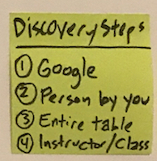
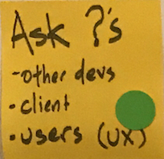
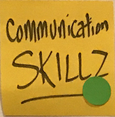

# Week 2, September 27

* Test Driven Development
* User Stories
* The Terminal
  * Install node

## Topics Covered

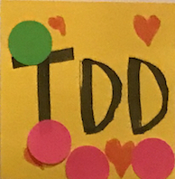
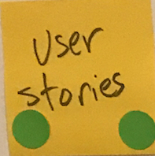
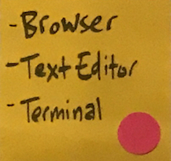

# Week 3, October 4

* What is CI/CD? What is Agile?
* Stories in Pivotal Tracker
  * Making a story
  * Setting an owner
  * Adding an estimate
  * Getting review and approval
* Travis & Code Climate
  * Set up configuration files
* Pop quiz! Kahoot game on data types.

## Topics Covered

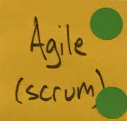
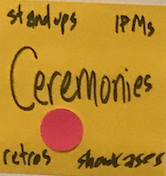
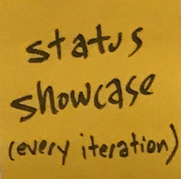
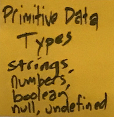

# Week 4, October 11

* [The Terminal](The-Terminal#navigation)
  * Look at [this page](https://github.com/amajor/intro-to-programming/tree/master/lessons/module1) with your browser console open and go through the exercises.
  * Clone [this repository](https://github.com/amajor/intro-to-programming) to your local machine or Cloud9
  * Navigate into the `lessons/module` directory and open _index.html_ in your browser and _module1.js_ in your editor
  * Work through the exercises in _module1.js_
  * Read the READMEs in [Module 2](https://github.com/amajor/intro-to-programming/tree/master/lessons/module2), [Module 3](https://github.com/amajor/intro-to-programming/tree/master/lessons/module3), and [Module 4](https://github.com/amajor/intro-to-programming/tree/master/lessons/module4).
* [GitHub and Git](The-Terminal#git)
  * `git clone`
  * `git pull`
  * `git push`
  * `git commit`
  * `git branch`
  * `git log`
* Our personal dashboard repositories
  * Create a new branch
  * Add index.html
  * Adding a header using a font from Google fonts
  * Create a pull request
  * Request a review from someone in the class
    * If review is given, DON'T be satisfied! Request a change of some sort. Use the story in Pivotal Tracker as a form of communication.

## Topics Covered

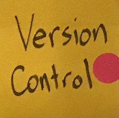

# Week 5, October 18

* Attempt to set up server

# Week 6, October 25

* Review we're we've been and what we still need to cover.
  * 
* Start with templated user story for server setup
  * The story provides us with a very clear picture of the steps to follow to get that server set up.
  * Find the story and a walk-through of that story [here](Server-Setup). 👈 _click me!_
* [Homework](https://classroom.github.com/a/1kL7QD3q) 👈 _click me!_
  * This exercise gets you into some javascript with very little setup.
  * 🎧 Watching the linked videos in the assignment are necessary to work through it, so depending on your setting for working on this, have headphones handy.

## Topics Covered

# Week 7, November 1

* Touch on what Frameworks, Libraries, and APIs are
  * What's the difference?
  * What are the benefits?
  * What to look out for when using open source code
* Second Half of Class
  * Work on your apps!
  * Everyone expressed some feature they'd like to work on; Kendell has fleshed out the story for you to give you guidance towards getting that done.
  * This will be self-guided, with Kendell, Alison, and your classmates available to help you move forward.
  * There are no failures; we get stuck, we Google and solve, we move forward.

## Topics to Cover

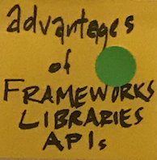
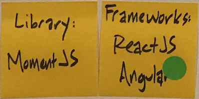
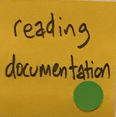

# Week 8, November 8

* Dig deeper into functions
  * From exercises, you should be familiar with functions already, but let's walk through it some more to take away some of the mystery
* Work on your apps!

## Topics to Cover

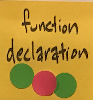
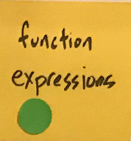
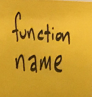
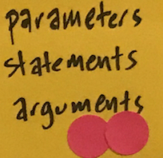
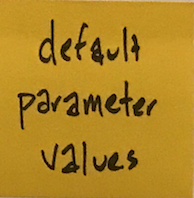
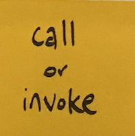

# Week 9, November 15

* **GUEST!** Brandon Keepers from GitHub
  * 🐦 [@bkeepers](https://twitter.com/bkeepers)
  * :octocat: [@bkeepers](https://github.com/bkeepers)
* What are APIs?
* Databases, Arrays, Objects
* Conditionals and Loops
  * [Want to learn about JavaScript’s for loops? This animated SCUBA diver can help!](https://medium.freecodecamp.org/want-to-learn-about-javascripts-for-loops-this-animated-scuba-diver-can-help-76a038a09cc8)
* Work on your apps!

## Topics to Cover

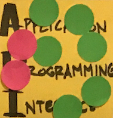

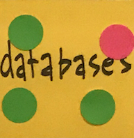
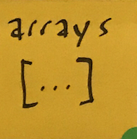
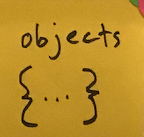
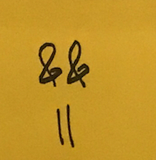
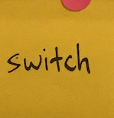
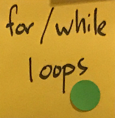

# Week 10, November 29

* What is ES6?
  * The story of ECMAScript
* What are code reviews?
* Set up tests in our dashboards
  * Invite Kendell's GitHub user to collaborate on your app and he'll help you set up the test suite.
* Work on your apps!

## Topics to Cover

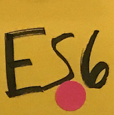
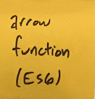
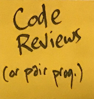

# Week 11, December 6

* Refactoring
* Tech Debt
  * [What is Technical Debt and Why Do Most Startups Have It?](https://medium.freecodecamp.org/what-is-technical-debt-and-why-do-most-startups-have-it-9a54458daabf)
* Code Smells
  * [Do you really know when your code smells?](https://www.telerik.com/blogs/bad-code-exposed-do-you-really-know-when-your-code-smells)
* Presentations
  * Show us your app!
  * Don't want to show it? Show us one of your code failures.
* Work on your apps!

## Topics to Cover

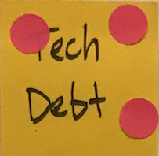
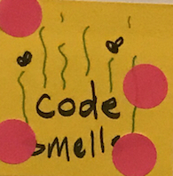
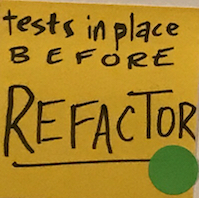
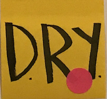

# Week 12, December 13

* Which language?!?!?!
  * [Learn to Program, Not a Programming Language](https://codeburst.io/learn-to-program-not-a-programming-language-9c0f56c21935)
* Presentations
  * Show us your app!
  * Don't want to show it? Show us one of your code failures.
* Work on your apps!

## Topics to Cover

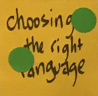

# Graduation, December 19

Be at The Factory at 6pm. You're graduating!

***

# Not explicitly covered in class...

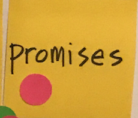
