### Table of Contents

* [Week 1](Winter-2018.md#week-1-january-17) (January 17)
* [Week 2](Winter-2018.md#week-1-january-24) (January 24)
* [Topics not yet covered](Winter-2018.md#looking-forward)

# Week 1, January 17

* Introductions
  * Who is Alison?
  * Who is Kendell?
  * Who are you?
* Soft Skills vs. Hard Skills
  * Things to cover!
  * 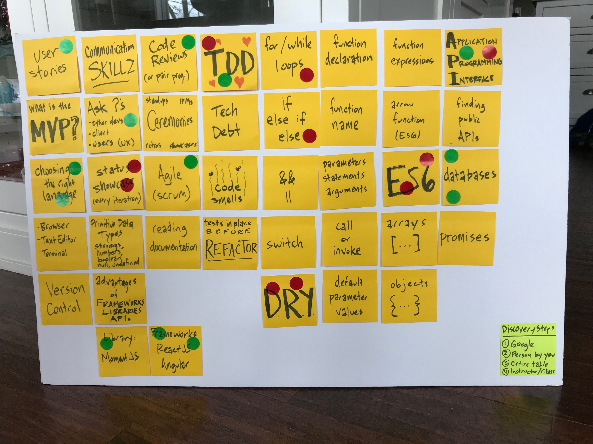
* Laptop Setup
* GitHub
  * Commits
  * Pull Requests
* **HOMEWORK:** Add yourself to the class page in [this repository](https://github.com/HappyCoLearning/programming-winter-2018). A [video](https://youtu.be/TuMV9UTHmuw) and a [gist](https://gist.github.com/amajor/a9e02a85cdd7126bcf12778aa8a92c87) are available to help you through it.

## Topics Covered

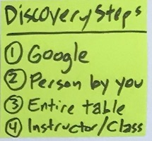
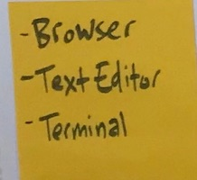

# Week 2, January 24

* Review everyone's Pull Request from the past week.
  * https://github.com/HappyCoLearning/programming-winter-2018/pulls
* **ACTIVITY:** Strategies Markdown
* **HOMEWORK:**
* **ARTICLE:**

## Topics Covered

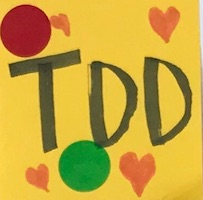
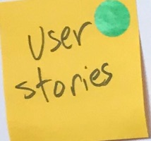

***

# Looking forward...

These are tentative plans that are subject to change. Just because it's on the
schedule for the future doesn't mean that you can't do some research on your
own. Google is your friend!

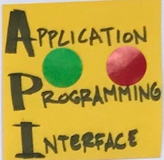
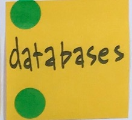
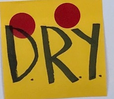
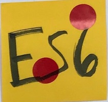
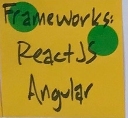
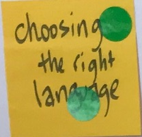
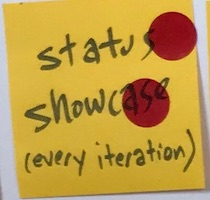

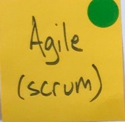
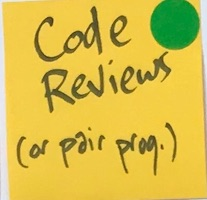
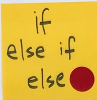
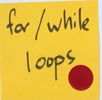
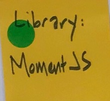
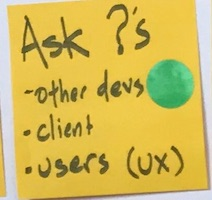

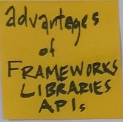

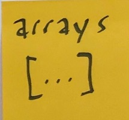
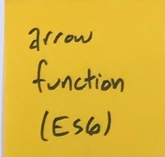
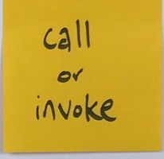
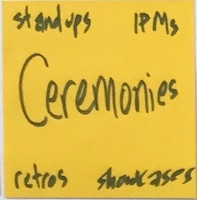
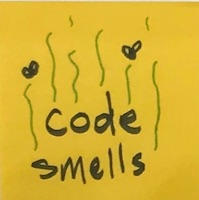

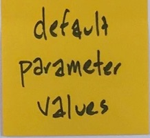
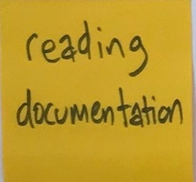

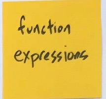
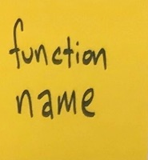
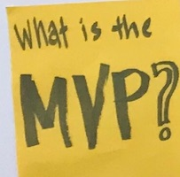
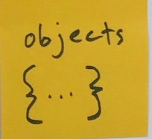
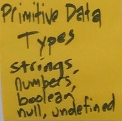

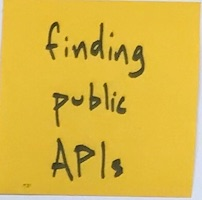
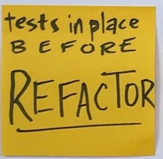
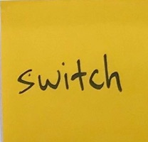

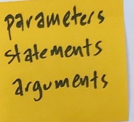
