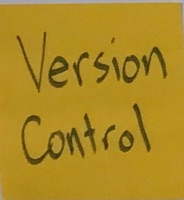
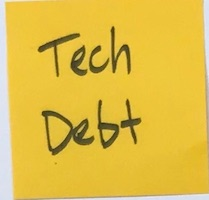

### Table of Contents

* [Week 1](Winter-2018.md#week-1-january-17) (January 17)
* [Week 2](Winter-2018.md#week-2-january-24) (January 24)
* [Week 3](Winter-2018.md#week-3-january-31) (January 31)
* [Week 4](Winter-2018.md#week-4-february-7) (February 7)
* **Studio Tour:** Elevator Up (February 8)
* [Week 5](Winter-2018.md#week-5-february-14) (February 14)
* [Week 6](Winter-2018.md#week-6-february-21) (February 21)
* [Week 7](Winter-2018.md#week-7-february-28) (February 28)
* [Week 8](Winter-2018.md#week-8-march-7) (March 7)
* **Studio Tour:** Atomic Object (March 8)
* [Week 9](Winter-2018.md#week-9-march-14) (March 14)
* [Week 10](Winter-2018.md#week-10-march-21) (March 21)
* [Week 11](Winter-2018.md#week-11-march-28) (March 28)
* [Week 12](Winter-2018.md#week-12-april-4) (April 4)
* **Graduation Open House** (April 10)
* [Topics not yet covered](Winter-2018.md#looking-forward)

# Week 1, January 17

* Introductions
  * Who is Alison?
  * Who is Kendell?
  * Who are you?
* Soft Skills vs. Hard Skills
  * Things to cover!
  * 
* Laptop Setup
* GitHub
  * Commits
  * Pull Requests
* **HOMEWORK:** Add yourself to the class page in [this repository](https://github.com/HappyCoLearning/programming-winter-2018). A [video](https://youtu.be/TuMV9UTHmuw) and a [gist](https://gist.github.com/amajor/a9e02a85cdd7126bcf12778aa8a92c87) are available to help you through it.

## Topics Covered

# Week 2, January 24

* Review everyone's Pull Request from the past week.
  * https://github.com/HappyCoLearning/programming-winter-2018/pulls
* Test Driven Development
* **ACTIVITY:** Strategies Markdown
* **HOMEWORK:** JavaScript Intro
  * Video: https://youtu.be/cZTpzU8dYp8
  * Repository: https://github.com/amajor/exercise-js-intro
* **ARTICLE:** [The Outrageous Cost of Skipping TDD & Code Reviews](https://medium.com/javascript-scene/the-outrageous-cost-of-skipping-tdd-code-reviews-57887064c412)

## Topics Covered

# Week 3, January 31

* Create a Microservice using Arc
* **ACTIVITY:**
* **HOMEWORK:**
* **ARTICLE:**

# Week 4, February 7

* CI/CD/CD
* Agile Crash Course
* **ACTIVITY:**
* **HOMEWORK:** 
  * Research some CI Tools. Create an account for one (try [Travis CI](https://travis-ci.org/)!).
  * If you're feeling ambitious, hook up one of your repositories to a CI server and add the badge to your README file!
* **ARTICLE:** [The life-changing wonder of Continuous Integration and Deployment](https://medium.freecodecamp.org/the-life-changing-wonder-of-continuous-integration-and-deployment-97f833505eea)

## Topics Covered

# Week 5, February 14

* <topics here>
* **ACTIVITY:**
* **HOMEWORK:**
* **ARTICLE:**

# Week 6, February 21

* <topics here>
* **ACTIVITY:**
* **HOMEWORK:**
* **ARTICLE:**

# Week 7, February 28

* <topics here>
* **ACTIVITY:**
* **HOMEWORK:**
* **ARTICLE:**

# Week 8, March 7

* <topics here>
* **ACTIVITY:**
* **HOMEWORK:**
* **ARTICLE:**

# Week 9, March 14

* <topics here>
* **ACTIVITY:**
* **HOMEWORK:**
* **ARTICLE:**

# Week 10, March 21

* <topics here>
* **ACTIVITY:**
* **HOMEWORK:**
* **ARTICLE:**

# Week 11, March 28

* <topics here>
* **ACTIVITY:**
* **HOMEWORK:**
* **ARTICLE:**

# Week 12, April 4

* <topics here>
* **ACTIVITY:**
* **HOMEWORK:**
* **ARTICLE:**

***

# Looking forward...

These are tentative plans that are subject to change. Just because it's on the
schedule for the future doesn't mean that you can't do some research on your
own. Google is your friend!

